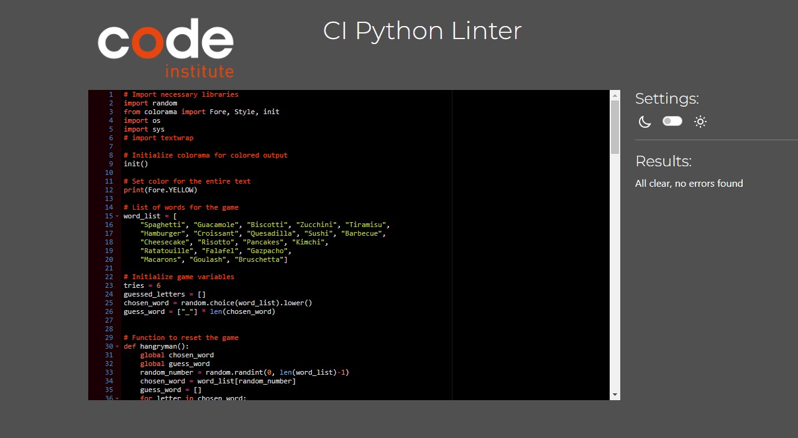

# Hangry Man Game

Hangry Man is a fun, food-themed version of the classic game Hangman. The game selects a random food-related word, and the player must guess the word one letter at a time.

## Code Explanation

1. **Import necessary modules**: The `random` module is used to select a random word from a list, and the `colorama` module is used to color the text output. `os` & `sys` grant improved console functionality.

```python
import random
from colorama import Fore, Style, init
import os
import sys
```

2. **Initialize colorama**: This is necessary for the colorama module to function properly.
   
```init()```

3. **Set text colour**:
   
```print(Fore.YELLOW)```

4. **Word list**: This is a list of food-related words that the game can choose from.

```
word_list = [
    "Spaghetti", "Guacamole", "Biscotti", "Zucchini", "Tiramisu",
    "Hamburger", "Croissant", "Quesadilla", "Sushi", "Barbecue",
    "Cheesecake", "Risotto", "Pancakes", "Kimchi",
    "Ratatouille", "Falafel", "Gazpacho",
    "Macarons", "Goulash", "Bruschetta"]
```

5. **Game variables**: The `tries` variable keeps track of how many guesses the player has left, `guessed_letters` is a list of letters the player has already guessed, `chosen_word` is the word the player needs to guess (selected randomly from the word list and converted to lowercase), and `guess_word` is a list of underscores representing the letters in the chosen word.

```
tries = 6
guessed_letters = []
chosen_word = random.choice(word_list).lower()
guess_word = ["_"] * len(chosen_word)
```

6. **Hangryman function**: This function resets the `chosen_word` and `guess_word` variables for a new game. It selects a new random word from the word list and creates a new list of underscores for the `guess_word`.

```
def hangryman():
    global chosen_word
    global guess_word
    random_number = random.randint(0, len(word_list)-1)
    chosen_word = word_list[random_number]
    guess_word = []
    for letter in chosen_word:
        guess_word.append("_")
```

7. **Welcome message**: This prints a welcome message and asks the player if they want to see the instructions.

```
print('''
Welcome to Hangry Man, the most delicious hangman game you've ever played!

In this game, your taste buds are put to the test as you guess food-related
words. From appetizers to desserts, cuisines from around the world,
there's a smorgasbord of culinary terms waiting for you.
''')

show_instructions = input("Would you like to see the instructions? (yes/no): ")
if show_instructions.lower() == "yes":
    print('''
Here's how it works:
1. A random food-related word will be chosen, and you'll see a series of
underscores representing each letter in the word.

2. You can guess one letter at a time or try to guess the whole word.
Incorrect guesses will start to build the hangry man.

3. With each wrong guess, our hangry man gets closer to losing his patience.
You have six tries before he loses his cool.

4. If you guess the word correctly before the hangry man is complete, you win!
If not, the hangry man will have to go hungry, and you'll get to know the
correct word.

So, put on your chef's hat, and let's get cooking! Can you guess the word
before the hangry man loses his cool? Good luck, and may the best foodie win!
''')
```

8. **Game loop**: This is the main game loop. It continues as long as the player has tries left. In each iteration, it prints the current state of the hangman, asks the player for a guess, checks if the guess is correct, and updates the game state accordingly. 

```
while tries > 0:
    print("\n", stages[6-tries])
    print("\nYou have", tries, "tries left\n")
    guess = input("Guess a letter or the whole word: ")
    if guess in guessed_letters:
        print("\nYou've already guessed this letter.\n")
        continue
    guessed_letters.append(guess)
    if len(guess) == 1:
        correct_guess = False
    for i in range(len(chosen_word)):
        if chosen_word[i] == guess:
            guess_word[i] = guess
            correct_guess = True
    print(' '.join(guess_word))

    if "_" not in guess_word:
        print("\nCongratulations, you won!\n")
        break
    if correct_guess:
        print("\nGood job! You've guessed a letter correctly.\n")
    else:
        tries -= 1
        print("\nWrong guess. You have", tries, "tries left\n")

    if len(guess) == len(chosen_word):
        if guess == chosen_word:
            print("\nCongratulations, you won!\n")
            break
        else:
            tries -= 1
            print("Wrong guess. You have", tries, "tries left")

    if tries == 0:
        print("\n", stages[6])
        print("\nYou lost! The word was:", chosen_word, "\n")
```

9. **Start the game**: Finally, the `hangryman()` function is called to start the game.

```
hangryman()
```

## Testing

VALIDATOR TESTING
Python code tested and no significant errors shown. Code passed through:



[**CI PYTHON LINTER**](https://pep8ci.herokuapp.com/https://raw.githubusercontent.com/) 

### Manual testing results

| Test Case | Steps | Expected Outcome | Status |
| --- | --- | --- | --- |
| Game Initialization | Start the game | The game should print the welcome message and ask if the user wants to see the instructions | Passed |
| Instructions | Enter 'yes' when asked if you want to see the instructions | The game should print the instructions | Passed |
| Word Selection | Start a new game | The game should select a random word from the word list and display the correct number of underscores | Passed |
| Correct Guess | Guess a letter that is in the word | The game should reveal the letter in the correct position(s) | Passed |
| Incorrect Guess | Guess a letter that is not in the word | The game should decrement the number of tries left and display the next stage of the hangman | Passed |
| Repeat Guess | Guess a letter that has already been guessed | The game should inform the user that the letter has already been guessed | Passed |
| Win Game | Correctly guess all the letters in the word | The game should congratulate the user for winning | Passed |
| Lose Game | Make 6 incorrect guesses | The game should inform the user that they lost and reveal the correct word | Passed |


# Deployment

The application has been deployed using a template provided by the Code Institute, allowing others to test the code.

The project has been deployed on Heroku with the following steps:

1. Use `pip freeze > requirements.txt` to add external libraries to the deployed app.
2. Create a Heroku account. You can find a step-by-step guide here.
3. Click 'New' in the top right corner of the Heroku dashboard.
4. Click 'Create new app'.
5. Name your app and select your region from the dropdown menu.
6. Click 'Create new app'.
7. Navigate to the 'settings' tab.
8. Scroll down to the 'config vars' section and add a key: `PORT` and value: `8000`.
9. Scroll down to the 'Buildpacks' section.
10. Click 'Add buildpack'.
11. Add Python as the first dependency and click 'Save changes'.
12. Add node.js as the second dependency and save again.
13. Select the 'Deploy' tab at the top.
14. Select 'Github' from the 'Deployment method'.
15. Type the name of your Github project and click 'search'.
16. Scroll down and select the manual deployment method.
17. Enable automatic deploys to update the project every time you push the code from Gitpod.
18. Click to view the app.

# Cloning the Repository

To clone the repository:

1. Navigate to the repository on Github.
2. Click the green "Code" button above the file list.
3. Copy the URL of the repo using HTTPS, SSH, or Github CLI.
4. Open Git Bash.
5. Change the current working directory to the location where you want the cloned directory.
6. Type `git clone`, and then paste the URL you copied earlier.
7. Press enter to create a local clone.

For more details on how to clone a remote repo to create a local copy, please visit this link.

# Forking

To fork the repository:

1. Navigate to the repository on Github.
2. Click "Fork" located towards the top right corner.
3. Select the "owner" for the forked repo from the dropdown menu under "owner".
4. The forked repo will be created under the same name as the original by default, but you can type a name in the "Repository name" field or add a description in the "Description" box.
5. Click "Create fork".

Forking allows you to make changes without affecting the original project. You can suggest changes by submitting a pull request. The project owner can review the pull request before accepting the suggestions and merging them.

For more details on how to fork a repo, please visit this link.

Note: When you fork a repository, you don't have access to the files locally on your device. To access the files locally, you will need to clone the forked repo.


Welcome,

This is the Code Institute student template for deploying your third portfolio project, the Python command-line project. The last update to this file was: **March 14, 2023**

## Reminders

- Your code must be placed in the `run.py` file
- Your dependencies must be placed in the `requirements.txt` file
- Do not edit any of the other files or your code may not deploy properly

## Creating the Heroku app

When you create the app, you will need to add two buildpacks from the _Settings_ tab. The ordering is as follows:

1. `heroku/python`
2. `heroku/nodejs`

You must then create a _Config Var_ called `PORT`. Set this to `8000`

If you have credentials, such as in the Love Sandwiches project, you must create another _Config Var_ called `CREDS` and paste the JSON into the value field.

Connect your GitHub repository and deploy as normal.

## Constraints

The deployment terminal is set to 80 columns by 24 rows. That means that each line of text needs to be 80 characters or less otherwise it will be wrapped onto a second line.

---

Happy coding!
